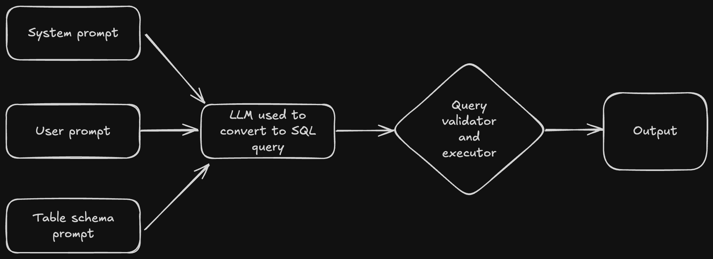

# footballqa

## Overview
Making a natural language question answering system for football [data](https://www.kaggle.com/datasets/davidcariboo/player-scores) scraped from transfermarkt.

## Architecture

The approach I have followed is the text-to-SQL query approach using LLMs. Using langchain's system [prompt](https://smith.langchain.com/hub/langchain-ai/sql-agent-system-prompt), a cusotm prompt to give more information about the schema and tables present in the database and the user prompt, this combination is then passed to the query validator and executor function. JSON parsing is done to extract the query from the response and then executed under a try-except block to gracefully handle errors.
